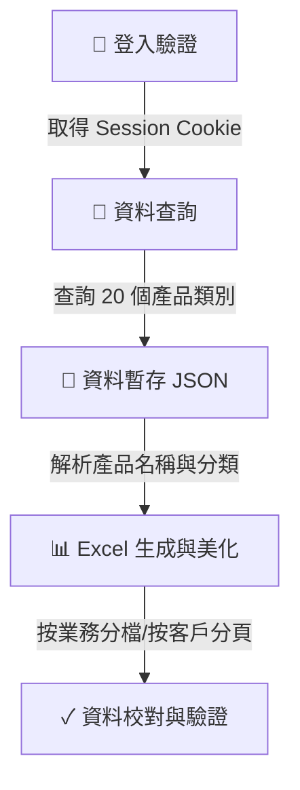

# 國中講義單冊出貨統計作業說明

本文件詳細紀錄金安出版社 `h-office` 系統中，關於「國中講義單冊出貨統計表」的資料查詢、解析處理、報表生成及格式優化等完整運作流程。

---

## 📌 一、 運作流程概述

整個統計流程可分為四大階段：



1. **登入驗證**：透過 Google OAuth 登入 `h-office` 取得 `beaker.session.id`，存入 `cookies.json`。
2. **資料查詢**：依指定日期區間（例如 `114.4.26 ~ 114.9.25`）查詢 20 個單冊講義相關的產品類別，過濾特定區域（例如「北區」或「中區」）與業務人員，將結果存成 JSON 檔。
3. **資料解析與分級**：解析產品名稱，辨識出冊別（一至六冊）、年級（一、三、五）、科目與版本（康版、南版、翰版、綜合版）。
4. **Excel 生成與美化**：使用 `exceljs` 依業務產生專屬 Excel 活頁簿，每位客戶獨立成一個工作表（Sheet）。套用指定色塊、黑線框線與公式彙整。
5. **資料校對與驗證**：執行驗證腳本，比對原始 JSON 總量與產出 Excel 數據，確保無任何遺漏。

---

## 🔐 二、 系統驗證與連線設定

金安出版社 `h-office` 辦公管理系統網址為 `https://h-office.king-an.com.tw:8082`。由於該系統憑證特性，在執行 Node.js 連線時必須套用特殊設定：

*   **忽略 TLS 未授權拒絕**：`process.env.NODE_TLS_REJECT_UNAUTHORIZED = "0"`
*   **自訂 HTTPS Agent**：啟用相容性以支援 DH 密鑰，設定 `ciphers: "DEFAULT@SECLEVEL=0"`, `minVersion: "TLSv1"`。
*   **Session 存放**：登入完成後，Session ID 將以 `cookies.json` 形式保存在專案根目錄中，供查詢腳本調用。

---

## 📡 三、 資料抓取與篩選流程 (Querying)

### 1. 查詢目標產品類別 (共 20 個)
統計表僅納入國中講義的**單冊**（非複習）講義，共包含以下 20 個系統產品類別（Product Classes）：

| 類別大項 | 系統產品類別名稱 (Product Class) |
| :--- | :--- |
| **雙向** | `國中講義:雙向-康版(上)`、`國中講義:雙向-康版(下)`、`國中講義:雙向-南版(上)`、`國中講義:雙向-南版(下)`、`國中講義:雙向-翰版(上)`、`國中講義:雙向-翰版(下)` |
| **735** | `國中講義:735-康版(上)`、`國中講義:735-康版(下)`、`國中講義:735-南版(上)`、`國中講義:735-南版(下)`、`國中講義:735-翰版(上)`、`國中講義:735-翰版(下)` |
| **試題篇** | `國中講義:試題-康版(上)`、`國中講義:試題-康版(下)`、`國中講義:試題-南版(上)`、`國中講義:試題-南版(下)`、`國中講義:試題-翰版(上)`、`國中講義:試題-翰版(下)` |
| **新講義** | `國中講義:新講義(上)`、`國中講義:新講義(下)` |

### 2. 人員篩選與系統名稱對齊
在篩選業務人員時，需特別注意**系統內登記名稱**是否與名單完全一致：
*   **北區業務名單**：何光傑、李敏豪、林智偉、康晉瑋（注意：使用者提供「康晉**偉**」，系統實際登記為「康晉**瑋**」）、朱鵬學。
*   **中區業務名單**：蔡榮訓、曹原菘、林廣強。

> [!WARNING]
> 若業務姓名字元不符（如 偉/瑋），直接查詢會導致該業務的數據遺漏。在資料請求時已修正為系統對應的姓名，並於查詢完畢後合併至同一資料檔中。

---

## 🧪 四、 產品解析與資料處理規則 (Parsing)

自系統取得的原始資料，產品欄位（例如：`國中雙向講義國文(一)（１）--康版`）需透過正則表達式解析，拆解為 Excel 對應表格的維度：

### 1. 冊別與年級映射
*   產品名稱中包含全形括號加冊數，如 `（１）` 至 `（６）` 或 `(1)` 至 `(6)`。
*   **年級映射規則**：
    *   **一冊（１）、二冊（２）** $\rightarrow$ 對應表格中的「**一**」年級欄位
    *   **三冊（３）、四冊（４）** $\rightarrow$ 對應表格中的「**三**」年級欄位
    *   **五冊（５）、六冊（６）** $\rightarrow$ 對應表格中的「**五**」年級欄位

### 2. 版本分類
*   `康版`、`-康版` $\rightarrow$ **K版**
*   `南版`、`-南版` $\rightarrow$ **N版`**
*   `翰版`、`翰版` $\rightarrow$ **H版**
*   新講義系列 $\rightarrow$ **綜合版**

### 3. 科目歸納規則
不同大項的講義，其開展的科目有所不同，對齊規則如下：

*   **雙向**：包含「國文」、「英語」、「數學」、「自然」四科。
*   **735**：包含「國文」、「英語」、「數學」、「自然」、「地理」、「歷史」六科。
*   **試題篇**：
    *   產品名包含「英語文法」 $\rightarrow$ 對應「**英語**」欄位
    *   產品名包含「英語閱讀素養」或「*英語閱讀素養」 $\rightarrow$ 對應「**閱讀英文**」欄位
    *   產品名包含「數學」 $\rightarrow$ 對應「**數學**」欄位
*   **新講義**：僅包含「數學」、「自然」二科。

---

## 📊 五、 Excel 報表結構與美化規範 (Styling)

為求報表易讀、美觀且具備極致的視覺精緻度，報表套用以下視覺規範：

### 1. 工作表 (Sheet) 配置
*   **個別業務檔案**：命名為 `[業務姓名]_114上單冊講義.xlsx`。
    *   **首個頁籤**：為 `客戶加總`，加總該業務下所有客戶的所有數據，提供業務整體的出貨統計。
    *   **後續頁籤**：為該業務轄下的個別「客戶名稱」工作表，依中文筆劃與字母進行排序。
*   **區域合計總表檔案**：在 `Output/` 目錄下產出：
    *   `北區單冊講義總數量合計總表.xlsx`：彙整北區 5 位業務所有客戶的合計出貨數據，內含單一工作表 `總數量合計總表`。
    *   `中區單冊講義總數量合計總表.xlsx`：彙整中區 3 位業務所有客戶的合計出貨數據，內含單一工作表 `總數量合計總表`。
    *   `各區單冊講義產品總數量表.xlsx`：彙整北區、中區、南區大區的所有出貨量，內含四個工作表（`總表`、`北區`、`中區`、`南區`）。
*   **列印設定**：所有工作表均預設為橫向列印（Landscape）、自動調整至一頁寬。

### 2. 色彩搭配與字型 (Color Palette)
全書使用 `微軟正黑體`，字型大小依階層設定。調色盤規範如下：

| 元素 | 背景顏色 (ARGB) | 字型設定 | 說明 |
| :--- | :--- | :--- | :--- |
| **大標題列** | `FF1F4E79` (深藍) | 14pt, 粗體, 白色字 | 橫跨整個表格頂端，顯示年份與客戶名稱 |
| **表格首列** | 依各區塊主色 (下述) | 10pt, 粗體, 白色字 | 顯示科目名稱 |
| **年級次列** | `FFD6E4F0` (淺藍) | 10pt, 粗體, 深藍字 | 顯示 一、三、五 年級 |
| **合計列** | `FFFFF2CC` (淡黃) | 10pt, 粗體, 咖啡字 | 各大區塊的加總數據列 |
| **統計數據欄**| `FFDCE6F1` (灰藍) | 10pt, 粗體, 黑色字 | 右側「訂書」、「退貨」、「實際出貨」欄 |
| **雙向區塊** | `FF70AD47` (綠色) | 11pt (首欄標籤粗體白字) | 資料行套用淡綠色背景 |
| **735 區塊** | `FFED7D31` (橘色) | 11pt (首欄標籤粗體白字) | 資料行套用淡橘色背景 |
| **試題篇區塊**| `FF5B9BD5` (藍色) | 11pt (首欄標籤粗體白字) | 資料行套用淡藍色背景 |
| **新講義區塊**| `FF7030A0` (紫色) | 11pt (首欄標籤粗體白字) | 資料行套用淡紫色背景 |

### 3. 表格框線 (Borders)
為了在 Microsoft Excel 等軟體中能清晰顯示所有格線，腳本特別加強框線處理：
*   **全單元格框線**：包含空白儲存格與合併儲存格（Slaves），一律套用細黑線（`#000000`）。
*   **區塊分隔線**：每個大講義區塊的「合計」列底端，套用中等粗細黑線（Medium Bottom Border），建立強烈的視覺分隔線。

### 4. 統計欄位公式與格式
*   **三欄式統計**：各區塊右側附帶「訂書」、「退貨」、「實際出貨」三欄。
    *   **訂書**：自動累加該版本所有科目的總和。
    *   **實際出貨**：即目前實際的淨出貨量（訂書 - 退貨），當前退貨欄為 0 時與訂書量相同。
*   **數值格式**：所有數量單元格皆套用千分位格式化（`#,##0`），且數值為 0 或空值時維持空白以保持版面乾淨。

### 5. 各品項及年級加總彙整表
工作表最底部（「新講義」區塊隔一行空行後）設有「各品項及年級加總表」彙整區：
*   **結構欄位**：包含「品項」、「一年級」、「三年級」、「五年級」、「總本數」等 5 欄。
*   **品項列數**：雙向、735、試題篇、新講義，以及最後一列的「合計」。
*   **動態公式設計**：
    *   **雙向/735/試題篇/新講義各年級**：使用 Excel `SUM` 公式，將上方區塊合計列中，該年級對應科目的數量單元格進行加總。例如雙向一年級加總公式為 `=SUM(D8,G8,J8,M8)`。
    *   **各品項總本數**：直接引用上方各區塊合計列的「實際出貨」單元格。例如雙向總本數公式為 `=R8`。
    *   **合計列**：動態加總彙整表中的數值。例如合計一年級為 `=SUM(B34:B37)`，合計總本數為 `=SUM(E34:E37)`。
*   **版面框線限縮**：彙整表僅佔用 A~E 欄。為求版面整潔，最後的邊框處理已限縮至第 5 欄，使彙整表右側保持無框線的白底狀態。

---

## 💻 六、 腳本執行指令與操作步驟

### 1. 更新驗證金鑰 (Session Cookie)
若 Cookie 過期或首次執行，請先執行登入：
```bash
# Windows 環境變數設定並登入
$env:H_OFFICE_EMAIL="your_account@gmail.com"
$env:H_OFFICE_PASSWORD="your_password"
npm run login
```

### 2. 執行資料查詢
查詢對應區域的資料，資料將會儲存於專案目錄下的 JSON 檔案中：
```bash
# 查詢北區（包含一般業務）
node query_north_single_volume.js

# 補查康晉瑋（修正姓名偏差）
node query_kang.js

# 查詢中區
node query_central_single_volume.js

# 查詢北、中、南三區所有資料 (無業務篩選)
node query_all_regions.js
```

### 3. 產生 Excel 報表
讀取暫存 JSON 資料並產出優化樣式的 Excel 檔案，產出路徑為 `Output/` 資料夾：
```bash
# 產生個別業務檔案與分區總表
node generate_styled_xlsx.js

# 產生全區 (北、中、南區) 合併總表
node generate_regions_xlsx.js
```

### 4. 驗證資料正確性
執行自動化驗證腳本，檢查 Excel 中的數量加總是否與 JSON 原始資料與加總彙整表的公式格式完全吻合：
```bash
# 執行個別業務與分區大總表驗證
node verify_styled.js
node verify_summary_tables.js

# 執行全區合併總表驗證
node verify_regions.js
```
